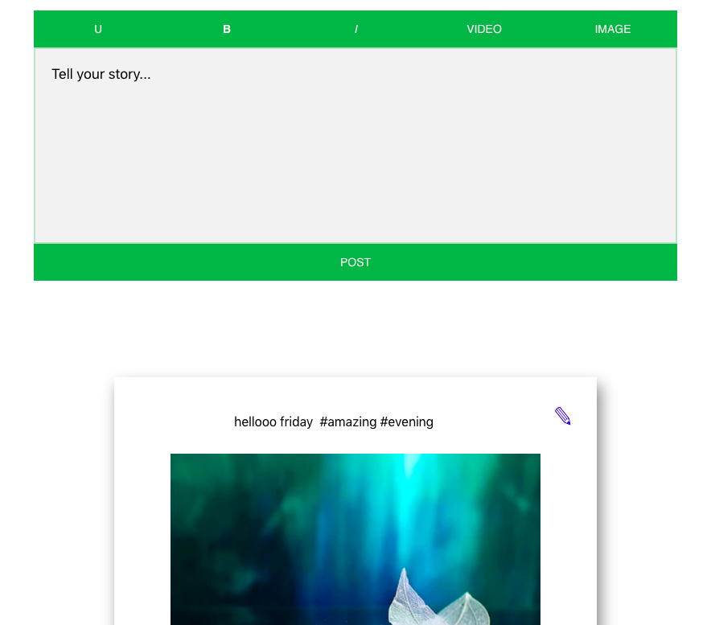

A text editor for users of facebook-like website, where users can post their content.

## Available Scripts

In the project directory, you can run:

### `npm start`

Runs the app in the development mode. 
Open [http://localhost:3000](http://localhost:3000) to view it in the browser.

The page will reload if you make edits. 
You will also see any lint errors in the console.

## Project description 
 User would be able to post content/text, hashtag(word starting with #), URL and attach images and video.Everything that starts from # should be treated as a hashtag and it would get highlighted with blue color.User can edit submitted post by clicking edit or pencil icon to edit post and can update text, hashtag, URL, image or video.

